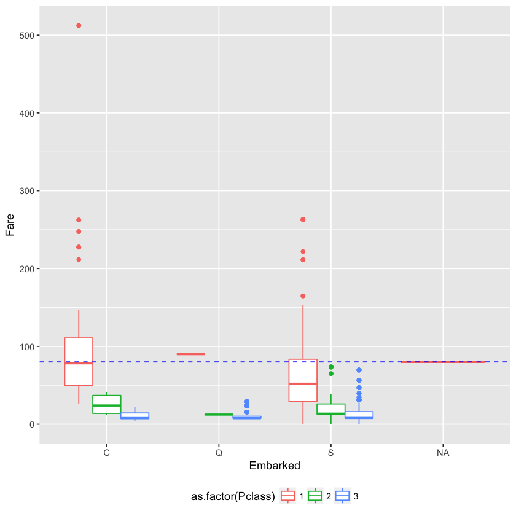
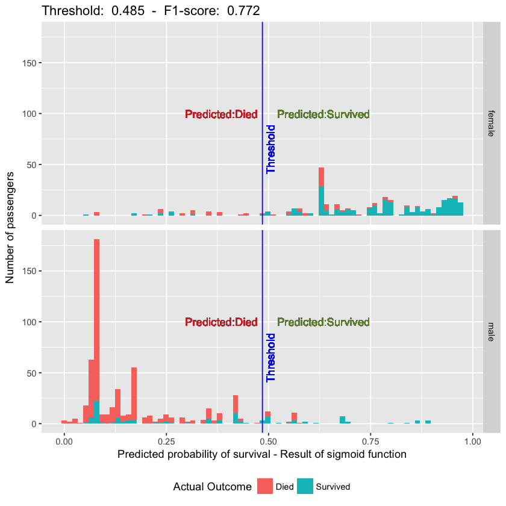

The following Titanic kernel is based on the logistic regression theory that is part of the course Machine Learning on Coursera by Andrew Ng.


```R
# This R environment comes with all of CRAN preinstalled, as well as many other helpful packages
# The environment is defined by the kaggle/rstats docker image: https://github.com/kaggle/docker-rstats
# For example, here's several helpful packages to load in 

library(ggplot2) # Data visualization
library(readr) # CSV file I/O, e.g. the read_csv function

# Input data files are available in the "../input/" directory.
# For example, running this (by clicking run or pressing Shift+Enter) will list the files in the input directory

system("ls ../input")

test_data <- read_csv("test.csv")
train_data <- read_csv("train.csv")

library(ggplot2)
library(dplyr)
library(tidyr)
library(readr)

# Any results you write to the current directory are saved as output.
```

    Parsed with column specification:
    cols(
      PassengerId = col_integer(),
      Pclass = col_integer(),
      Name = col_character(),
      Sex = col_character(),
      Age = col_double(),
      SibSp = col_integer(),
      Parch = col_integer(),
      Ticket = col_character(),
      Fare = col_double(),
      Cabin = col_character(),
      Embarked = col_character()
    )
    Parsed with column specification:
    cols(
      PassengerId = col_integer(),
      Survived = col_integer(),
      Pclass = col_integer(),
      Name = col_character(),
      Sex = col_character(),
      Age = col_double(),
      SibSp = col_integer(),
      Parch = col_integer(),
      Ticket = col_character(),
      Fare = col_double(),
      Cabin = col_character(),
      Embarked = col_character()
    )


```R
# Generic function to format both training and test set
format.tables <- function(df){
  
  #df$Survived <- as.factor(df$Survived)
  df$Pclass <- as.factor(df$Pclass)
  df$Sex <- as.factor(df$Sex)
  df$Embarked <- as.factor(df$Embarked)
  
  # Dummy variable for Sex
  df$Sex.int <- 0
  df[df$Sex == 'male',]$Sex.int <- 1
  
  # Dummy variable for Pclass
  #df$Pclass <- as.integer(df$Pclass)
  tmp <- model.matrix(PassengerId ~ Pclass,df[,c('PassengerId','Pclass')])
  df <- cbind(df,tmp[,-1])
  
  # Dummy variable if passenger has cabin
  df$has_cabin <- 0
  df[!is.na(df$Cabin),]$has_cabin <- 1
  
  tmp <- model.matrix(PassengerId ~ Embarked,df[,c('PassengerId','Embarked')])
  df <- cbind(df,tmp[,-1])
  
  #df$embarked.C <- 0
  #df$embarked.Q <- 0
  #df[df$Embarked == 'C',]$embarked.C <- 1
  #df[df$Embarked == 'Q',]$embarked.Q <- 1
  
  df$age_missing <- 0
  df[is.na(df$Age),]$age_missing <- 1
  
  # Titles
  titles <- df %>% select('Name') %>% 
    separate(col = Name,into = c('A','B'), sep = ',') %>% 
    separate(col = B,into = c('A2','B2'), sep = '. ') %>% 
    select('A2')
  
  df$title <-trimws(titles$A2)
  # df$title <- as.factor(df$title)
  tmp <- table(df$title) < 15
  df[tmp[df$title] == TRUE,]$title <- 'Other'
  
  tmp <- model.matrix(Name ~ title,df[,c('title','Name')])
  df <- cbind(df,tmp[,-1])
  
  return(df)
}
```

The following basic functions are defined:
1. Sigmoid function (https://en.wikipedia.org/wiki/Sigmoid_function)
2. Logistic regression cost function. Based on the cost function we fit the optimum parameters for the model


```R
# Sigmoid function
G <- function(z) {
  return(1 / (1 + exp(-z)))
}

# Defaut definition of Z
# Not used in the actual code
# Z <- t(theta) %*% X

# Cost function
J <- function(theta, X, y){
  z <- X %*% theta
  sigmoid <- G(z)
  m <- length(y)
  res <- (-t(y) %*% log(sigmoid) - (t(1 - y) %*% log(1 - sigmoid)))/m
  return(res)
}

# Hypothesis function sample
# Not used in the actual code
# H <- G(Z)

```

From reviewing the initial train data, we identify that the embarked port is missing from a couple of passengers.


```R
table(is.na(train_data$Embarked))
```


    
    FALSE  TRUE 
      889     2 


In order to fill those values, we will use the fare payed by passengers for the different ports (this idea originates from a different kernel but it is very easy to use to fill in the missing values).


```R

# Diclaimer: Idea was found on different kernel
# Filling missing Embarked data
p1 <- ggplot(train_data)
p1 + aes(x = Embarked, y = Fare, color = as.factor(Pclass)) + 
  geom_boxplot() + 
  geom_hline(yintercept = median(train_data[is.na(train_data$Embarked),]$Fare), 
             linetype = 'dashed', color = 'blue')  + theme(legend.position="bottom")
```





It looks like the media fare value for the passengers without a port is matching port C. Let's fill the missing values.


```R
# Fill missing embarked lines based on median
train_data[is.na(train_data$Embarked),]$Embarked <- 'C'
```

**Now it is time for the exciting things! The following operations take place:**
* Format the data into dummy 0/1 variables so we can then feed the columns into the sigmoid function


```R
# Format coloumns to 0/1 dummy format
test_data <- format.tables(test_data)
train_data <- format.tables(train_data)
```

    Warning message:
    “Too many values at 269 locations: 2, 3, 5, 6, 8, 9, 10, 12, 13, 15, 16, 19, 20, 22, 23, 24, 25, 26, 27, 29, ...”Warning message:
    “Too many values at 576 locations: 1, 2, 4, 5, 7, 8, 9, 10, 11, 13, 14, 15, 16, 18, 19, 21, 23, 24, 25, 26, ...”


```R
coloumns.to.fit <- c('Pclass2','Pclass3','Sex.int',
                     'SibSp','Parch',
                     'has_cabin','age_missing',
                     'EmbarkedQ','EmbarkedS', 'titleMiss', 'titleMr', 'titleMrs','titleOther')

head(train_data[,coloumns.to.fit],10)
```


<table>
<thead><tr><th scope=col>Pclass2</th><th scope=col>Pclass3</th><th scope=col>Sex.int</th><th scope=col>SibSp</th><th scope=col>Parch</th><th scope=col>has_cabin</th><th scope=col>age_missing</th><th scope=col>EmbarkedQ</th><th scope=col>EmbarkedS</th><th scope=col>titleMiss</th><th scope=col>titleMr</th><th scope=col>titleMrs</th><th scope=col>titleOther</th></tr></thead>
<tbody>
	<tr><td>0</td><td>1</td><td>1</td><td>1</td><td>0</td><td>0</td><td>0</td><td>0</td><td>1</td><td>0</td><td>1</td><td>0</td><td>0</td></tr>
	<tr><td>0</td><td>0</td><td>0</td><td>1</td><td>0</td><td>1</td><td>0</td><td>0</td><td>0</td><td>0</td><td>0</td><td>1</td><td>0</td></tr>
	<tr><td>0</td><td>1</td><td>0</td><td>0</td><td>0</td><td>0</td><td>0</td><td>0</td><td>1</td><td>1</td><td>0</td><td>0</td><td>0</td></tr>
	<tr><td>0</td><td>0</td><td>0</td><td>1</td><td>0</td><td>1</td><td>0</td><td>0</td><td>1</td><td>0</td><td>0</td><td>1</td><td>0</td></tr>
	<tr><td>0</td><td>1</td><td>1</td><td>0</td><td>0</td><td>0</td><td>0</td><td>0</td><td>1</td><td>0</td><td>1</td><td>0</td><td>0</td></tr>
	<tr><td>0</td><td>1</td><td>1</td><td>0</td><td>0</td><td>0</td><td>1</td><td>1</td><td>0</td><td>0</td><td>1</td><td>0</td><td>0</td></tr>
	<tr><td>0</td><td>0</td><td>1</td><td>0</td><td>0</td><td>1</td><td>0</td><td>0</td><td>1</td><td>0</td><td>1</td><td>0</td><td>0</td></tr>
	<tr><td>0</td><td>1</td><td>1</td><td>3</td><td>1</td><td>0</td><td>0</td><td>0</td><td>1</td><td>0</td><td>0</td><td>0</td><td>0</td></tr>
	<tr><td>0</td><td>1</td><td>0</td><td>0</td><td>2</td><td>0</td><td>0</td><td>0</td><td>1</td><td>0</td><td>0</td><td>1</td><td>0</td></tr>
	<tr><td>1</td><td>0</td><td>0</td><td>1</td><td>0</td><td>0</td><td>0</td><td>0</td><td>0</td><td>0</td><td>0</td><td>1</td><td>0</td></tr>
</tbody>
</table>


* Initialize the parameters (theta.initial) so the algorithm can start fitting the values


```R
# Vector of zeros: [0,0,0, ... ,0] equal to the number of columns
theta.initial <- as.vector(rep(0,length(coloumns.to.fit)))
```

* Use the built-in R function "optim" to find the parameters theta (theta.optimized) that minimize the J cost function of the logist regression. 


```R
# Select the coloums that will be used
X <- as.matrix(train_data[,coloumns.to.fit])
y <- train_data$Survived
# Find parameters theta that optimize (minimize) the cost function J.
# The cost function measures the difference between predicted and actual class
theta.optimized <- optim(theta.initial ,
                         fn = J, 
                         X = X, 
                         y = y,
                         control = list(maxit = 1000000))$par
```

* Evaluate the result of the sigmoid function (probability of survival) for the complete training set using the optimized parameters theta.


```R
# Based on the optimized theta, generate the output values of the sigmoid function
sigmoid.result <- G(X %*% theta.optimized)
```

* The logistic regression requires to set the threshold based on which a passenger is classified as Survivor or not (it is not 50-50!). In order to do this, we use the training set to find the sweet spot (unfortunately I have not implemented cross-validation here).


```R
# The logistic regretion requires to define the threshold that splits the two classes.
# The threshold is a value in the set (0,1) - not inclusive
# Find the thershold that maximises F1
F1.max = 0
F1 = 0
threshold <- 0
for(i in seq(from=0.01, to=1, by=0.005)){
  # For each possible value of the threhold
  # update predictions and evaluate F1
  y_predict <- sigmoid.result > i
  y_predict[y_predict == T] <- 1
  y_predict[y_predict == F] <- 0
  # Performance
  results.table <- table(y_predict, train_data$Survived)
  if (sum(dim(results.table)) == 4) {
    precision <- results.table[2,2] / (results.table[2,2] + results.table[2,1])
    recal <- results.table[2,2] / (results.table[2,2] + results.table[1,2])
    F1 <- 2 * precision * recal / (precision + recal)   
    # print(paste('Threshold: ', threshold, ' - ', 'F1: ', F1))
    if (F1 >= F1.max){
      F1.max <- F1
      threshold <- i
      # print(paste('Threshold: ', threshold, ' - ', 'F1: ', F1.max))
    }
  } 
}
```

**At this point, we have evaluated:**
* Optimized theta parameters


```R
print(theta.optimized)
```

     [1]  0.06295784 -0.76250913  1.82062871 -0.28509531 -0.26396409  1.38122839
     [7] -0.17340021 -0.34270297 -0.55458968  1.82742543 -2.94846951  2.17018348
    [13] -2.42796863


* Comparison of actual versus predicted survival


```R
# Final optimum prediction
y_predict <- sigmoid.result > threshold
y_predict[y_predict == T] <- 1
y_predict[y_predict == F] <- 0

# Performance on train set
results.table <- table(y_predict, train_data$Survived,dnn = c('Predicted','Actual'))
print(results.table)
```

             Actual
    Predicted   0   1
            0 479  83
            1  70 259


* Optimized classification threshold based on the F1-score (https://en.wikipedia.org/wiki/F1_score)


```R
precision <- results.table[2,2] / (results.table[2,2] + results.table[2,1])
recal <- results.table[2,2] / (results.table[2,2] + results.table[1,2])
F1 <- 2 * precision * recal / (precision + recal)   
print(paste('Threshold calculated: ', threshold, ' - ', 'F1-score: ', F1))
```

    [1] "Threshold calculated:  0.485  -  F1-score:  0.771982116244411"


**Time for some easy-to-digest algorithm performance depiction.** 

In the following graph we have:
* The X-axis is the outcome of the sigmoid fuction (survival probability for each survivor)
* The Y-axis is the number of passengers.
* The vertical blue line represents the optimum threshold we have defined for this particular problem. All data points on the left of the line are predicted to have died. All data points on the right are predicted to have survived.
* Data points in blue vs red represent the actual outcome on the training set.
* The training set is split into male/female just becuase the differences are huge between those groups.


```R

# Visualization
tmp <- cbind(as.data.frame(sigmoid.result), train_data$Survived,train_data$Sex)
names(tmp) <- c('sigmoid','Actual Outcome','Sex')
tmp$'Actual Outcome' <- as.character(tmp$'Actual Outcome')
tmp[tmp$`Actual Outcome` == 1,]$`Actual Outcome` <- 'Survived'
tmp[tmp$`Actual Outcome`== 0,]$`Actual Outcome` <- 'Died'
tmp$`Actual Outcome` <- as.factor(tmp$`Actual Outcome`)
p1 <- ggplot(tmp)
p1 + aes(x = sigmoid, fill = `Actual Outcome`) + geom_histogram(bins = 75) + 
  ggtitle(paste('Threshold: ', threshold, ' - ', 'F1-score: ', round(F1.max,3) )) +
  geom_vline(xintercept= threshold, color = 'blue') + facet_grid(Sex ~ .) +
  geom_text(aes(x=threshold - 0.10, label="Predicted:Died", y=100), colour="brown3", angle=0) +
  geom_text(aes(x=threshold + 0.15, label="Predicted:Survived", y=100), colour="darkolivegreen4", angle=0) +
  geom_text(aes(x=threshold + 0.02, label="Threshold", y = 65), colour="blue", angle=90) +
  xlab('Predicted probability of survival - Result of sigmoid function') +
  ylab('Number of passengers') + theme(legend.position="bottom")
```





It looks like the basic implementation of the logistic regression algorithm has delivered quite decent results without any complicated feature engineering and without fully utilizing variables like age, fare and ticket. Those are points for further investigation. However, even with this implementation, it achieves 0.77990 accuracy; not bad for a start.

Please let me know of comments, ideas for improvements as well as any critical points missed in the process.
